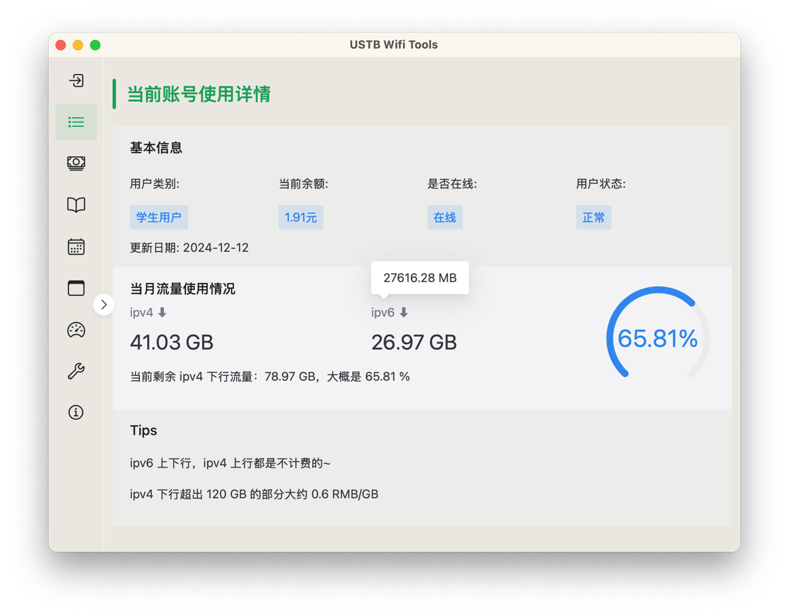

# USTB Wifi Tools 贝壳校园网实用工具

## 简介

使用 Tauri 构建的跨平台 APP，前端使用 Vue + NaiveUI，后端使用 Rust。 \
通过
旨在可以让大家更方便的获取 USTB 校园网每日使用情况，查询流量，解绑 MAC 地址等。 \
通过调用校园网的 API，并且数据都在本地进行存储。

[关于校园网 V6 网络的相关解答和讨论](https://github.com/CakeAL/ustb-wifi-tools/discussions/6)

## 已有功能

- [x] 自动化登录校园网后台（或通过 WebVPN ），并获取 jsession ID
- [x] 在本地保存历史用户名、密码和电表号
- [x] 展示当前账号使用详情：余额，更新日期，流量使用情况等等
- [x] 显示年度扣费账单：本年共花费金额，使用时长，使用流量
- [x] 每日使用详情：可以选一天或者一个时间段，查看每次连接校园网以及断开连接过程的详细信息。以及这段时间总共使用的流量情况
- [x] 解绑 MAC 地址：可以显示当前设备无线网卡的 MAC 地址进行参考，以及解绑功能
- [x] 测速功能：可以选择不同测速点，贝壳内网，以及其他教育网 ipv6 测速点进行测速（不消耗校园网流量），同时显示当前公网 IP 地址
- [x] 关于页面：一些作者的废话以及我的捐赠打钱二维码，还有一些小 Tips
- [x] 查别人流量，和查电表
- [x] 通过 Onedrive 进行同步配置文件

## TODO

- [x] 通过校园网 VPN 转换校园网内网相关链接，在校外也可以使用这个 APP
- [x] 迁移框架版本至 Tauri 2
- [x] 更新提醒 
- [x] 前端页面美化
- [ ] 前端加入图表展示，更加直观
- [ ] 密码输入错误超过 3 次之后显示验证码（懒得搞，输错3次密码自己等半小时。）
- [ ] 给应用签名（苹果要钱，不签了）
- [ ] 设计应用图标，现在的图标是 Tauri 默认的

## 下载链接

1. Windows 系统请下载后缀为 `.exe`，一般需要下载 `x64` 的版本，如果你确定你的电脑是 ARM 架构芯片，请选择 `arm64` 版本。
2. 由于没有应用签名，会报毒，忽略即可，如果不信任我可以自己看源代码。然后给我打钱。
3. macOS 系统请下载后缀为`.dmg`，M 系列芯片（2020 年及以后）请选择 `aarch64` 版本，Intel 芯片请选择 `x64` 版本。
4. macOS 由于还没搞应用签名，需要使用 `xattr -cr /Applications/ustb-wifi-tools.app` 来跳过签名认证。
5. Linux 用户请自行编译，并按照 Tauri 的要求安装 webkit2gtk

> [!NOTE]  
> 这里有一个使用教程：[如何使用 USTB Wifi Tools](https://github.com/CakeAL/ustb-wifi-tools/blob/main/%E5%A6%82%E4%BD%95%E4%BD%BF%E7%94%A8%20USTB%20Wifi%20Tools%EF%BC%88%E5%90%AB%E5%A6%82%E4%BD%95%E6%96%B9%E4%BE%BF%E6%B3%A8%E9%94%80%E8%B4%A6%E5%8F%B7%EF%BC%89.pdf)

[点我跳转到 Release](https://github.com/CakeAL/ustb-wifi-tools/releases/)

## 截图




## 开发

目前支持 Windows 7 以上 x86 64 设备或 macOS，需要电脑安装 WebView2（Windows 10 和 11 默认安装）。 \
Linux 可以自行编译，详见[官方文档](https://tauri.app/start/prerequisites/#linux)。\
Android 可以自行编译，或者管我要个包装着玩，不保证功能全都能用。build 详见[准备](https://tauri.app/start/prerequisites/#android)，[签名](https://tauri.app/distribute/sign/android/)，[指令](https://tauri.app/distribute/google-play/#architecture-selection)。\
iOS 可以自行编译，详见官方文档，需要自行签名（苹果收你 99 美元/年）。\
首先确保你已经安装了[`Node.js`](https://nodejs.cn/download/)，[`pnpm`](https://www.pnpm.cn/)以及[`Rust环境`](https://www.rust-lang.org/zh-CN/tools/install)

```bash
# 安装 create-tauri-app
cargo install create-tauri-app --locked
# 安装tauri 命令行 https://tauri.app/zh-cn/blog/2022/09/15/tauri-1-1/#cargo-binstall-support-for-tauri-cli
cargo install tauri-cli --version "^2.0.0" --locked
# 运行
# 如果安装了 just
just d
# 或者
cargo tauri dev
# 或者
pnpm i
pnpm tauri dev
```

## 构建

```bash
# 如果安装了 just
just b
# 或者
cargo tauri build
# 或者
pnpm tauri build
```
